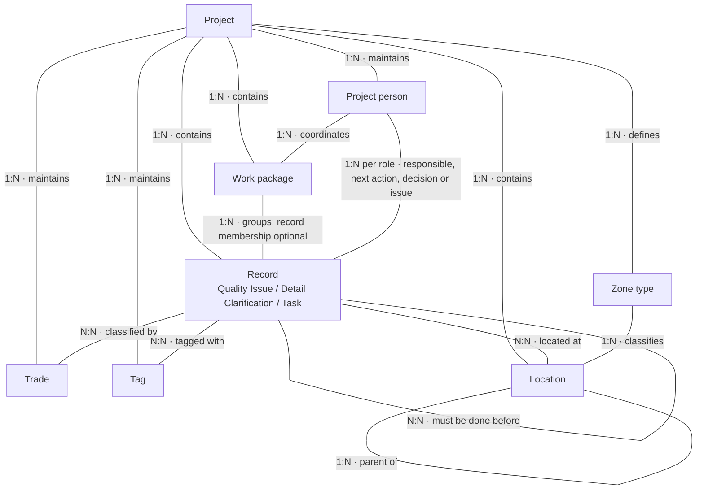
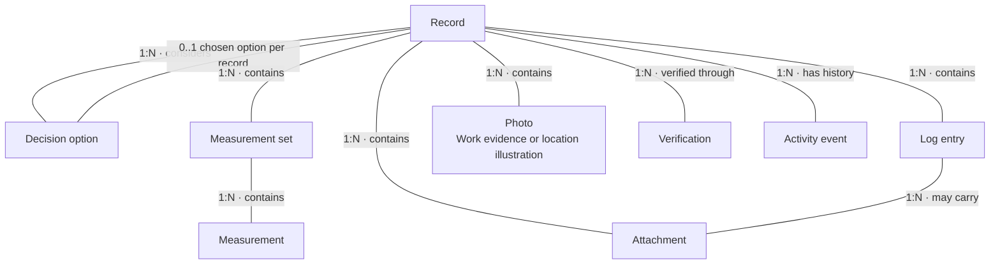
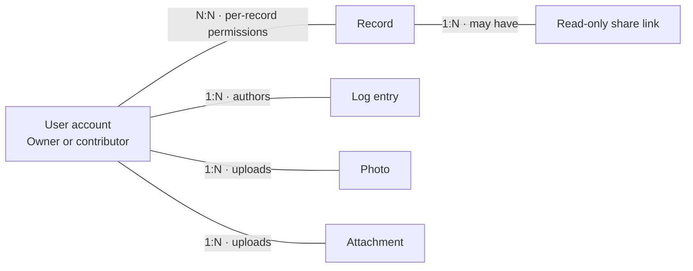
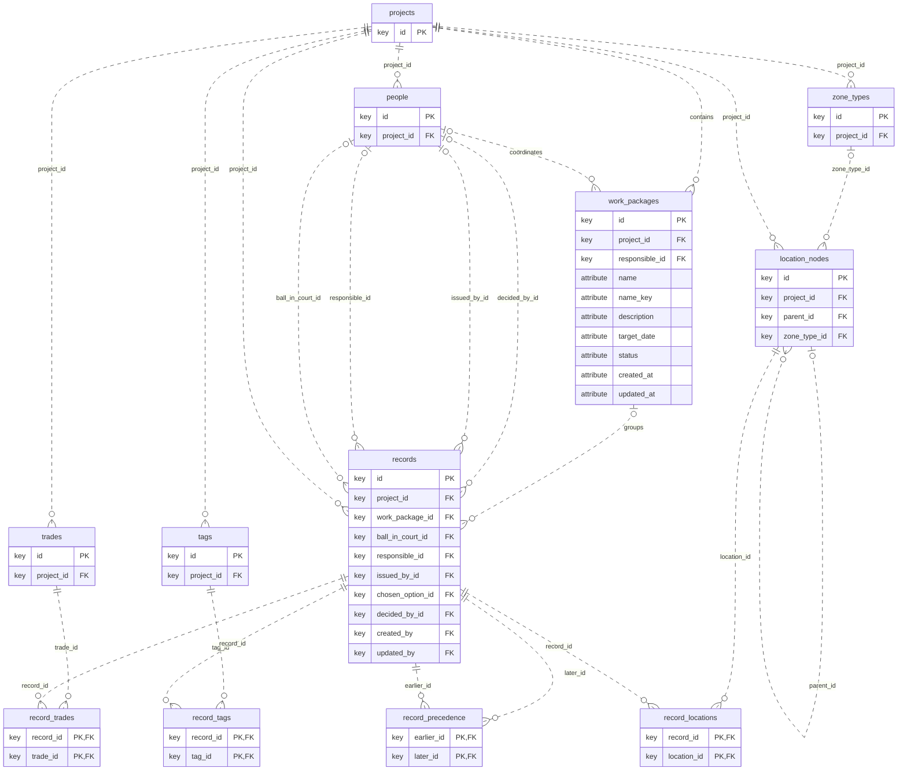
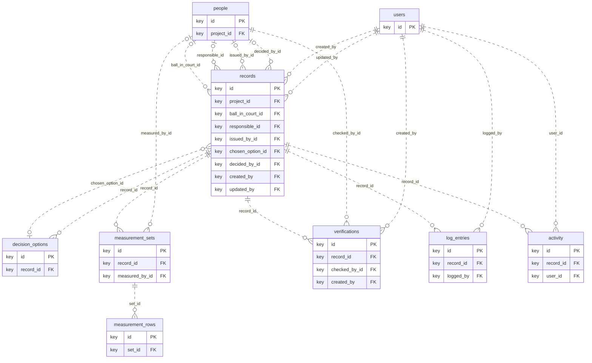
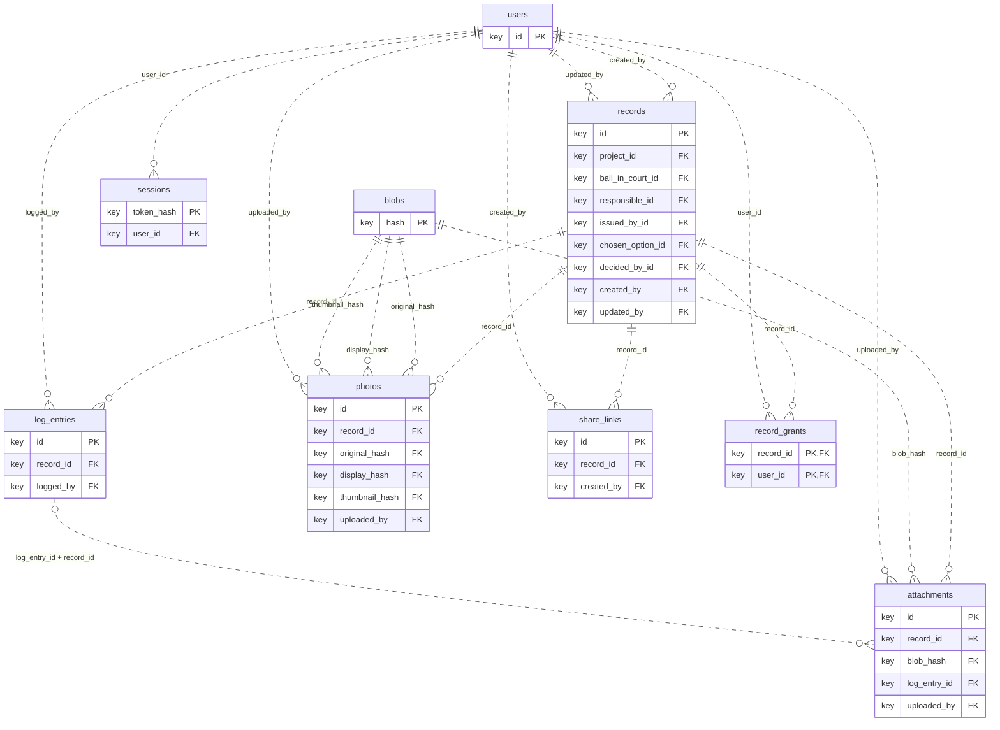

# BuiltBasis data model

> **Document type:** Architecture reference · **Status:** Current implementation reference · **Verified:** 2026-10-07 against migrations 0001–0007 in an isolated SQLite database. The deployment check on 2026-10-07 verified live schema 0007 and preservation of all prior columns/rows across 28 tables. Release `e445e1c` is deployed.

The conceptual model is the starting point for architectural decisions. It describes the business concepts, their ownership and their relationships. The logical model explains how they become relations and keys. The physical model records the SQLite implementation.

Related documents: [Architecture](../ARCHITECTURE.md), [v1 specification](../specs/v1.md), [migration registry](../../src/server/db/migrations.ts).

## 1. Conceptual model

### Reading the diagrams

**1:N** means one-to-many. **N:N** means many-to-many. These labels describe maximum cardinality; optional participation is explained below. The diagrams use business names, without implementation linking tables. A “Record” here means a Quality Issue, Detail Clarification or Task, not every row in the database.

### Project organisation



Each work package belongs to one project. A project may have zero or many packages. Each record belongs to zero or one package in its own project. Packages may be empty. Responsibility, status and target date belong to the package and never propagate to its records. Packages are not nested.

Each record and each managed-list item belongs to exactly one project. A project may have none or many of each. A record may select zero or many trades, tags and locations. Each person role on a record is optional and holds at most one person; the same person may occupy several roles. Each location has at most one parent and at most one zone type. A root location has no parent.

The precedence relationship is directed: one record must be done before another. Other record references remain free text. The three record subtypes share an identity and lifecycle; subtype-specific fields do not make them separate top-level entities.

### Work, decisions and evidence



Every child belongs to exactly one record, directly or through its measurement set. A record may have none or many of these children. An attachment may additionally belong to one Log entry on the same record. A record may choose one of its own decision options; choosing an option does not remove the alternatives.

Location photos illustrate the location of the particular record. They are independent of the location tree and do not belong to a location node. Location Notes is also record-specific. Public Notes, Private Notes, status, priority and severity are attributes of a record, not separate business entities. Measurement item and quantity are free text; there is no physical-element catalogue.

### Identity and access



A project person is a contact, not a login account. There is no implemented person-to-user relationship. The owner has application-wide authority. Contributors receive per-record grants with separate Upload and Add Log permissions. The N:N relationship above describes those contributor grants; it is not a requirement for owner access. Each share link belongs to exactly one record and requires no visitor account.

### Architectural boundaries to preserve or deliberately change

| Decision | Current model |
|---|---|
| Grouping | Optional work package, separate from overlapping trades and tags. |
| Unit of work | One generic Record with three subtypes. |
| Managed-list scope | People, trades, tags, locations and zone types belong to a project. |
| Location structure | A parent/child tree, selected through an N:N record relationship. |
| Location illustration | Photos and notes belong to the record, independently of tree nodes. |
| People versus accounts | Contacts and authenticated users are separate concepts. |
| Record relationships | Directed precedence only; other references are text. |
| File privacy | Permission belongs to each attachment/photo occurrence, not to shared file bytes. |
| Decisions | Options belong to a record; the chosen option and decision details are held on that record. |
| Workflow | Status is a record attribute governed by subtype and transition rules. |

Use this section to discuss a proposed architectural change first. Then trace the accepted change into the logical and physical sections. UI groupings such as Work and People and timing do not imply additional entities.

## 2. Logical relational model

These views show actual relation names and their key attributes, without SQLite storage types. **PK** identifies a primary key and **FK** a foreign key. Multiple PK attributes form a composite primary key. Crow’s-foot notation uses exactly one (`||`), zero or one (`o|`) and zero or many (`o{`). Dashed relationships avoid implying that every child depends on its parent for its primary-key identity.

The diagrams show declared key relationships. Same-project membership, choosing an option from the same record, and valid lifecycle transitions also require application validation. A foreign key alone does not enforce those rules.

### Projects, classification and people



### Decisions, measurements and history



### Files, sessions and access



### Relationship details

- The linking relations `record_trades`, `record_tags`, `record_locations` and `record_grants` implement N:N relationships. Their composite primary keys prevent duplicate pairs.
- `record_precedence` links two records as earlier and later. Its direction matters.
- `records.chosen_option_id` is nullable. The declared FK allows multiple records to point to an option; the server constrains selection to the owning record. That ownership rule makes the conceptual chosen-option relationship narrower than the raw FK diagram.
- The attachment-to-Log FK is composite: `(log_entry_id, record_id)` references `log_entries(id, record_id)`. It prevents an attachment from being assigned to a Log entry on a different record.
- Each photo references an original, display and thumbnail blob. These are three named relationships, not three kinds of photo ownership. Many occurrences may reference the same blob.
- Location photos and work-evidence photos share `photos`. The purpose attribute distinguishes them.
- `users` are referenced for authorship and auditing. `people` are referenced for project responsibilities, measuring and checking.

### Attributes and vocabularies

`records` holds common fields and nullable subtype fields. Its `notes` column is Private Notes; `public_notes` and `location_notes` are separate columns. There are no separate Quality Issue, Detail Clarification or Task tables.

Fixed values such as status, priority, severity and disposition use codes. Their bilingual labels and definitions are maintained in [vocabulary.data.ts](../../src/domain/vocabulary.data.ts). They are not database lookup relations. Managed labels for trades, tags, zone types and location nodes are database columns such as `name_en` and `name_el`. User-entered prose is not automatically translated.

The full column inventory follows in the physical model. These logical diagrams concentrate on keys so that relationships remain readable.

## 3. Physical model: SQLite implementation

### Storage and enforcement

| Concern | Implemented choice |
|---|---|
| Database engine | SQLite, accessed by better-sqlite3. |
| Connection | Foreign keys enabled; 5-second busy timeout; default rollback journal. |
| Identifiers | Integer IDs for business tables; composite keys for linking relations; hash keys for blobs and sessions. |
| Identifier reuse | Explicit project/record sequence tables; per-project/subtype human-number counters; AUTOINCREMENT on decision options, photos, attachments and share links. |
| Dates and codes | TEXT columns. Date formats and allowed vocabulary codes are validated by application schemas. |
| Flags | INTEGER values with 0/1 CHECK constraints where declared. |
| Money | Integer cents in estimated_cost_cents. |
| Measurements | REAL values, with units stored separately as codes. |
| Structured values | problem_types and activity values use JSON held in TEXT columns. |
| File bytes | Immutable files on disk; blobs holds their hash, size and content type. File bytes are not stored in SQLite. |
| Share tokens | Hash for lookup; encrypted token material in BLOB columns. The encryption key is outside the database. |
| Integrity | PKs, FKs, unique indexes and CHECK constraints plus server-side domain validation. |

Source: [connection configuration](../../src/server/db/connection.ts), [migration runner](../../src/server/db/migrate.ts), and the seven migrations imported by the registry.

SQLite is not declared in STRICT mode here. A declared column type does not by itself guarantee every business invariant. For example, status transitions and active-status required fields are server rules. A project_id FK and a person_id FK do not by themselves guarantee that the person belongs to the same project.

Deletion behaviour is mixed. Many record child relations use ON DELETE CASCADE, while photos, share links and other relations require explicit application handling. The owner deletion operation checks both directions of precedence inside an immediate transaction. It refuses deletion while either direction exists. It deletes photo/attachment occurrences and share links explicitly, then cascades record children. Identity counters and immutable blobs remain. Empty-only package deletion is also transactional; a referenced package cannot be deleted. Deleting an occurrence does not delete retained blob files.

### Supporting relations

| Relation | Purpose |
|---|---|
| record_counters | Human record-number sequence per project and subtype. |
| project_id_sequence | Monotonic internal project IDs. |
| record_id_sequence | Monotonic internal record IDs. |
| share_key_state | Current share encryption-key fingerprint; not the key itself. |
| schema_migrations | Applied migration IDs and timestamps. |
| sqlite_sequence | SQLite-managed AUTOINCREMENT state; an internal engine table. |

### Effective schema after migrations 0001–0007

The original 0001–0006 schema inventory was extracted on 2026-10-06. This inventory was regenerated on 2026-10-07 from `sqlite_schema` after applying all migrations to an in-memory database. Column and foreign-key PRAGMAs were also inspected. Generated indexes are implicit in the declarations; explicitly named indexes follow each table.

<details>
<summary>activity</summary>

```sql
CREATE TABLE activity (
      id INTEGER PRIMARY KEY,
      record_id INTEGER NOT NULL REFERENCES records(id) ON DELETE CASCADE,
      at TEXT NOT NULL,
      user_id INTEGER NOT NULL REFERENCES users(id),
      action TEXT NOT NULL,
      field TEXT,
      old_value TEXT,
      new_value TEXT,
      detail TEXT
    );
CREATE INDEX activity_record ON activity(record_id);
```

</details>

<details>
<summary>attachments</summary>

```sql
CREATE TABLE attachments (
      id INTEGER PRIMARY KEY AUTOINCREMENT, record_id INTEGER NOT NULL REFERENCES records(id), blob_hash TEXT NOT NULL REFERENCES blobs(hash),
      original_filename TEXT NOT NULL, title TEXT, log_entry_id INTEGER,
      uploaded_by INTEGER NOT NULL REFERENCES users(id), uploaded_at TEXT NOT NULL,
      FOREIGN KEY(log_entry_id, record_id) REFERENCES log_entries(id, record_id) ON DELETE CASCADE
    );
CREATE INDEX attachments_log ON attachments(log_entry_id);
CREATE INDEX attachments_record ON attachments(record_id);
```

</details>

<details>
<summary>blobs</summary>

```sql
CREATE TABLE blobs (
      hash TEXT PRIMARY KEY NOT NULL CHECK(length(hash) = 64 AND hash NOT GLOB '*[^0-9a-f]*'),
      size INTEGER NOT NULL CHECK(size > 0), content_type TEXT NOT NULL
    );
```

</details>

<details>
<summary>decision_options</summary>

```sql
CREATE TABLE decision_options (
      id INTEGER PRIMARY KEY AUTOINCREMENT,
      record_id INTEGER NOT NULL REFERENCES records(id) ON DELETE CASCADE,
      label TEXT NOT NULL,
      description TEXT,
      sort_order INTEGER NOT NULL,
      created_at TEXT NOT NULL
    );
CREATE INDEX decision_options_record ON decision_options(record_id);
```

</details>

<details>
<summary>location_nodes</summary>

```sql
CREATE TABLE location_nodes (
        id INTEGER PRIMARY KEY,
        project_id INTEGER NOT NULL REFERENCES projects(id),
        parent_id INTEGER REFERENCES location_nodes(id) ON DELETE CASCADE,
        kind TEXT NOT NULL,
        zone_type_id INTEGER REFERENCES zone_types(id),
        name_en TEXT NOT NULL DEFAULT '',
        name_el TEXT NOT NULL DEFAULT '',
        sort_order INTEGER NOT NULL DEFAULT 0,
        active INTEGER NOT NULL DEFAULT 1 CHECK (active IN (0, 1)),
        CHECK (name_en <> '' OR name_el <> '')
      );
CREATE INDEX location_nodes_parent ON location_nodes(project_id, parent_id);
```

</details>

<details>
<summary>log_entries</summary>

```sql
CREATE TABLE log_entries (
      id INTEGER PRIMARY KEY,
      record_id INTEGER NOT NULL REFERENCES records(id) ON DELETE CASCADE,
      event_at TEXT NOT NULL,
      text TEXT NOT NULL,
      private INTEGER NOT NULL DEFAULT 0 CHECK (private IN (0, 1)),
      logged_by INTEGER NOT NULL REFERENCES users(id),
      logged_at TEXT NOT NULL,
      edited_at TEXT
    );
CREATE UNIQUE INDEX log_entries_id_record ON log_entries(id, record_id);
CREATE INDEX log_entries_record ON log_entries(record_id);
```

</details>

<details>
<summary>measurement_rows</summary>

```sql
CREATE TABLE measurement_rows (
      id INTEGER PRIMARY KEY,
      set_id INTEGER NOT NULL REFERENCES measurement_sets(id) ON DELETE CASCADE,
      position INTEGER NOT NULL,
      item TEXT NOT NULL,
      quantity TEXT NOT NULL,
      value REAL NOT NULL,
      unit TEXT NOT NULL,
      note TEXT
    );
CREATE INDEX measurement_rows_set ON measurement_rows(set_id);
```

</details>

<details>
<summary>measurement_sets</summary>

```sql
CREATE TABLE measurement_sets (
      id INTEGER PRIMARY KEY,
      record_id INTEGER NOT NULL REFERENCES records(id) ON DELETE CASCADE,
      date TEXT NOT NULL,
      measured_by_id INTEGER REFERENCES people(id),
      phase TEXT NOT NULL,
      note TEXT,
      created_at TEXT NOT NULL
    );
CREATE INDEX measurement_sets_record ON measurement_sets(record_id);
```

</details>

<details>
<summary>people</summary>

```sql
CREATE TABLE people (
        id INTEGER PRIMARY KEY,
        project_id INTEGER NOT NULL REFERENCES projects(id),
        code TEXT NOT NULL,
        name TEXT NOT NULL,
        company TEXT,
        role TEXT NOT NULL,
        email TEXT,
        phone TEXT,
        active INTEGER NOT NULL DEFAULT 1 CHECK (active IN (0, 1)),
        UNIQUE (project_id, code)
      );
```

</details>

<details>
<summary>photos</summary>

```sql
CREATE TABLE "photos" (
      id INTEGER PRIMARY KEY AUTOINCREMENT, record_id INTEGER NOT NULL REFERENCES records(id),
      original_hash TEXT NOT NULL REFERENCES blobs(hash), display_hash TEXT NOT NULL REFERENCES blobs(hash), thumbnail_hash TEXT NOT NULL REFERENCES blobs(hash),
      original_filename TEXT NOT NULL, purpose TEXT NOT NULL DEFAULT 'evidence' CHECK(purpose IN ('evidence','location')),
      phase TEXT, caption TEXT, taken_at TEXT,
      uploaded_by INTEGER NOT NULL REFERENCES users(id), uploaded_at TEXT NOT NULL,
      CHECK ((purpose = 'evidence' AND phase IS NOT NULL AND phase IN ('before','during','after')) OR (purpose = 'location' AND phase IS NULL))
    );
CREATE INDEX photos_record ON photos(record_id);
```

</details>

<details>
<summary>project_id_sequence</summary>

```sql
CREATE TABLE project_id_sequence (
      singleton INTEGER PRIMARY KEY CHECK(singleton = 1),
      last_id INTEGER NOT NULL CHECK(last_id >= 0)
    );
```

</details>

<details>
<summary>projects</summary>

```sql
CREATE TABLE projects (
        id INTEGER PRIMARY KEY,
        code TEXT NOT NULL UNIQUE,
        name TEXT NOT NULL,
        created_at TEXT NOT NULL
      );
```

</details>

<details>
<summary>record_counters</summary>

```sql
CREATE TABLE record_counters (
      project_id INTEGER NOT NULL REFERENCES projects(id),
      subtype TEXT NOT NULL,
      last_sequence INTEGER NOT NULL,
      PRIMARY KEY (project_id, subtype)
    );
```

</details>

<details>
<summary>record_grants</summary>

```sql
CREATE TABLE record_grants (
      record_id INTEGER NOT NULL REFERENCES records(id) ON DELETE CASCADE,
      user_id INTEGER NOT NULL REFERENCES users(id),
      can_upload INTEGER NOT NULL CHECK (can_upload IN (0,1)),
      can_add_log INTEGER NOT NULL CHECK (can_add_log IN (0,1)),
      PRIMARY KEY (record_id, user_id)
    );
```

</details>

<details>
<summary>record_id_sequence</summary>

```sql
CREATE TABLE record_id_sequence (
      singleton INTEGER PRIMARY KEY CHECK(singleton = 1),
      last_id INTEGER NOT NULL CHECK(last_id >= 0)
    );
```

</details>

<details>
<summary>record_locations</summary>

```sql
CREATE TABLE record_locations (
      record_id INTEGER NOT NULL REFERENCES records(id) ON DELETE CASCADE,
      location_id INTEGER NOT NULL REFERENCES location_nodes(id),
      PRIMARY KEY (record_id, location_id)
    );
CREATE INDEX record_locations_location ON record_locations(location_id);
```

</details>

<details>
<summary>record_precedence</summary>

```sql
CREATE TABLE record_precedence (
      earlier_id INTEGER NOT NULL REFERENCES records(id) ON DELETE CASCADE,
      later_id INTEGER NOT NULL REFERENCES records(id) ON DELETE CASCADE,
      PRIMARY KEY (earlier_id, later_id),
      CHECK (earlier_id <> later_id)
    );
CREATE INDEX record_precedence_later ON record_precedence(later_id);
```

</details>

<details>
<summary>record_tags</summary>

```sql
CREATE TABLE record_tags (
      record_id INTEGER NOT NULL REFERENCES records(id) ON DELETE CASCADE,
      tag_id INTEGER NOT NULL REFERENCES tags(id) ON DELETE CASCADE,
      PRIMARY KEY (record_id, tag_id)
    );
CREATE INDEX record_tags_tag ON record_tags(tag_id);
```

</details>

<details>
<summary>record_trades</summary>

```sql
CREATE TABLE record_trades (
      record_id INTEGER NOT NULL REFERENCES records(id) ON DELETE CASCADE,
      trade_id INTEGER NOT NULL REFERENCES trades(id),
      PRIMARY KEY (record_id, trade_id)
    );
CREATE INDEX record_trades_trade ON record_trades(trade_id);
```

</details>

<details>
<summary>records</summary>

```sql
CREATE TABLE records (
      id INTEGER PRIMARY KEY,
      project_id INTEGER NOT NULL REFERENCES projects(id),
      subtype TEXT NOT NULL,
      sequence INTEGER NOT NULL,
      human_id TEXT NOT NULL,
      status TEXT NOT NULL,
      status_before_hold TEXT,
      status_reason_code TEXT,
      status_reason_note TEXT,
      title TEXT,
      description TEXT,
      reference TEXT,
      notes TEXT,
      ball_in_court_id INTEGER REFERENCES people(id),
      responsible_id INTEGER REFERENCES people(id),
      severity TEXT,
      priority TEXT,
      due_date TEXT,
      completion INTEGER CHECK (completion IS NULL OR (completion BETWEEN 0 AND 100 AND completion % 10 = 0)),
      safety INTEGER NOT NULL DEFAULT 0 CHECK (safety IN (0, 1)),
      outside_scope INTEGER NOT NULL DEFAULT 0 CHECK (outside_scope IN (0, 1)),
      estimated_cost_cents INTEGER CHECK (estimated_cost_cents IS NULL OR estimated_cost_cents >= 0),
      problem_types TEXT NOT NULL DEFAULT '[]',
      stage TEXT,
      disposition TEXT,
      correction TEXT,
      question TEXT,
      route TEXT,
      issued_by_id INTEGER REFERENCES people(id),
      chosen_option_id INTEGER REFERENCES decision_options(id),
      decided_by_id INTEGER REFERENCES people(id),
      decided_on TEXT,
      instruction_text TEXT,
      created_at TEXT NOT NULL,
      created_by INTEGER NOT NULL REFERENCES users(id),
      updated_at TEXT NOT NULL,
      updated_by INTEGER NOT NULL REFERENCES users(id), public_notes TEXT, location_notes TEXT, work_package_id INTEGER REFERENCES work_packages(id),
      UNIQUE (project_id, subtype, sequence),
      UNIQUE (project_id, human_id)
    );
CREATE INDEX records_project_package ON records(project_id, work_package_id);
CREATE INDEX records_project_status ON records(project_id, status);
```

</details>

<details>
<summary>schema_migrations</summary>

```sql
CREATE TABLE schema_migrations (id TEXT PRIMARY KEY, applied_at TEXT NOT NULL);
```

</details>

<details>
<summary>sessions</summary>

```sql
CREATE TABLE sessions (
        token_hash TEXT PRIMARY KEY,
        user_id INTEGER NOT NULL REFERENCES users(id) ON DELETE CASCADE,
        created_at TEXT NOT NULL,
        expires_at TEXT NOT NULL
      );
CREATE INDEX sessions_user ON sessions(user_id);
```

</details>

<details>
<summary>share_key_state</summary>

```sql
CREATE TABLE share_key_state (id INTEGER PRIMARY KEY CHECK(id=1), fingerprint TEXT NOT NULL);
```

</details>

<details>
<summary>share_links</summary>

```sql
CREATE TABLE share_links (
      id INTEGER PRIMARY KEY AUTOINCREMENT, record_id INTEGER NOT NULL REFERENCES records(id), label TEXT NOT NULL,
      token_hash TEXT NOT NULL UNIQUE, key_fingerprint TEXT NOT NULL, token_ciphertext BLOB NOT NULL, token_nonce BLOB NOT NULL, token_tag BLOB NOT NULL,
      created_by INTEGER NOT NULL REFERENCES users(id), created_at TEXT NOT NULL, expires_at TEXT, revoked_at TEXT, last_viewed_at TEXT,
      view_count INTEGER NOT NULL DEFAULT 0 CHECK(view_count >= 0)
    );
CREATE INDEX share_links_record ON share_links(record_id);
```

</details>

<details>
<summary>tags</summary>

```sql
CREATE TABLE tags (
        id INTEGER PRIMARY KEY,
        project_id INTEGER NOT NULL REFERENCES projects(id),
        name_el TEXT NOT NULL DEFAULT '',
        name_en TEXT NOT NULL DEFAULT '',
        name_el_key TEXT,
        name_en_key TEXT,
        CHECK (name_el <> '' OR name_en <> '')
      );
CREATE UNIQUE INDEX tags_el_unique ON tags(project_id, name_el_key) WHERE name_el_key IS NOT NULL;
CREATE UNIQUE INDEX tags_en_unique ON tags(project_id, name_en_key) WHERE name_en_key IS NOT NULL;
```

</details>

<details>
<summary>trades</summary>

```sql
CREATE TABLE trades (
        id INTEGER PRIMARY KEY,
        project_id INTEGER NOT NULL REFERENCES projects(id),
        code TEXT NOT NULL,
        name_en TEXT NOT NULL DEFAULT '',
        name_el TEXT NOT NULL DEFAULT '',
        def_en TEXT NOT NULL DEFAULT '',
        def_el TEXT NOT NULL DEFAULT '',
        active INTEGER NOT NULL DEFAULT 1 CHECK (active IN (0, 1)),
        UNIQUE (project_id, code),
        CHECK (name_en <> '' OR name_el <> '')
      );
```

</details>

<details>
<summary>users</summary>

```sql
CREATE TABLE users (
        id INTEGER PRIMARY KEY,
        username TEXT NOT NULL UNIQUE,
        password_hash TEXT NOT NULL,
        created_at TEXT NOT NULL,
        updated_at TEXT NOT NULL
      , is_owner INTEGER NOT NULL DEFAULT 0 CHECK (is_owner IN (0,1)), is_active INTEGER NOT NULL DEFAULT 1 CHECK (is_active IN (0,1)), display_name TEXT NOT NULL DEFAULT 'Contributor');
CREATE UNIQUE INDEX single_owner ON users(is_owner) WHERE is_owner = 1;
```

</details>

<details>
<summary>verifications</summary>

```sql
CREATE TABLE verifications (
      id INTEGER PRIMARY KEY,
      record_id INTEGER NOT NULL REFERENCES records(id) ON DELETE CASCADE,
      checked_by_id INTEGER NOT NULL REFERENCES people(id),
      date TEXT NOT NULL,
      method TEXT NOT NULL,
      outcome TEXT NOT NULL,
      note TEXT,
      created_at TEXT NOT NULL,
      created_by INTEGER NOT NULL REFERENCES users(id)
    );
CREATE INDEX verifications_record ON verifications(record_id);
```

</details>

<details>
<summary>work_packages</summary>

```sql
CREATE TABLE work_packages (
      id INTEGER PRIMARY KEY AUTOINCREMENT,
      project_id INTEGER NOT NULL REFERENCES projects(id),
      name TEXT NOT NULL CHECK(length(trim(name)) > 0),
      name_key TEXT NOT NULL,
      description TEXT,
      responsible_id INTEGER REFERENCES people(id),
      target_date TEXT,
      status TEXT NOT NULL DEFAULT 'planned'
        CHECK(status IN ('planned','in_progress','on_hold','completed','cancelled')),
      created_at TEXT NOT NULL,
      updated_at TEXT NOT NULL,
      UNIQUE(project_id, name_key)
    );
CREATE INDEX work_packages_responsible ON work_packages(responsible_id);
```

</details>

<details>
<summary>zone_types</summary>

```sql
CREATE TABLE zone_types (
        id INTEGER PRIMARY KEY,
        project_id INTEGER NOT NULL REFERENCES projects(id),
        name_en TEXT NOT NULL DEFAULT '',
        name_el TEXT NOT NULL DEFAULT '',
        CHECK (name_en <> '' OR name_el <> '')
      );
```

</details>

## 4. Work-package invariants

`work_packages` uses an integer AUTOINCREMENT key. `UNIQUE(project_id, name_key)` prevents names that normalize to the same case/accent/whitespace-folded key. A package has Name, Description, Responsible person, Target date and Status. Name and Status are required. The five statuses are Planned, In progress, On hold, Completed and Cancelled.

`records.work_package_id` is a nullable foreign key. No linking table is needed. Migration 0007 leaves existing records ungrouped. The API validates both package membership and package responsibility against the same project inside write transactions. These same-project rules are not implied by the individual foreign keys. New assignments cannot select retired people; an unchanged retired responsible person can remain.

Package counts are calculated from records. Draft counts as outstanding; Closed, Cancelled and Superseded do not. Overdue uses the Europe/Athens calendar date. The owner manages packages and membership. Readers receive only the current package name on an accessible record. They receive no package ID, navigation or sibling access. Membership activity retains name snapshots so historical moves survive package renaming or deletion.

A package may be deleted only when empty. Project deletion includes packages after its records are removed. No status or date cascades exist. Package completion/cancellation is manual and may coexist with outstanding records after confirmation.

## Maintaining this document

When the business model changes, update the conceptual section first as part of the architectural decision. Reconcile the logical relations and physical implementation when the change is delivered. Keep proposed changes explicitly separate from current behaviour.

For schema changes, apply all migrations to an empty disposable database and inspect sqlite_schema, PRAGMA table_info and PRAGMA foreign_key_list. Regenerate or reconcile the physical inventory and logical diagrams from that result. Do not edit an already-applied migration to make the diagram match a proposal.
